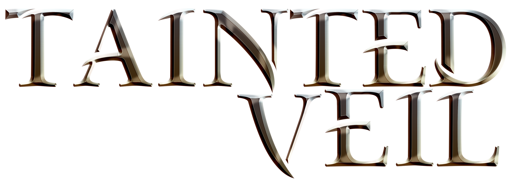
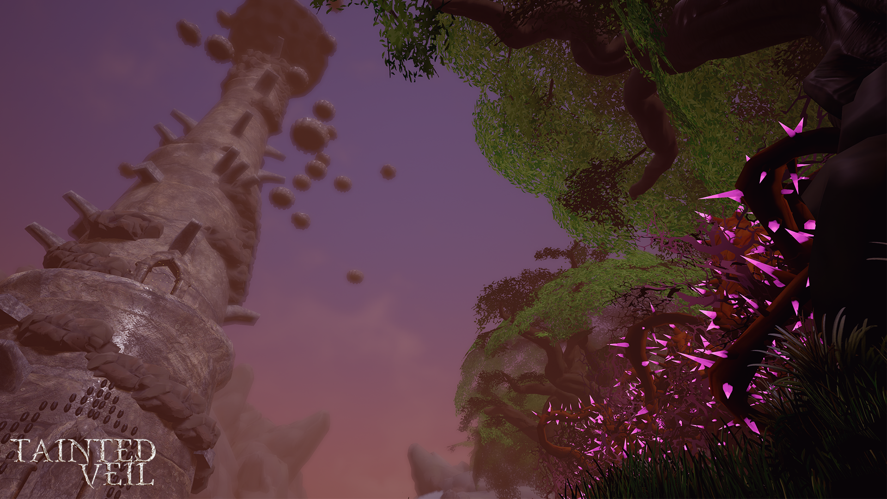
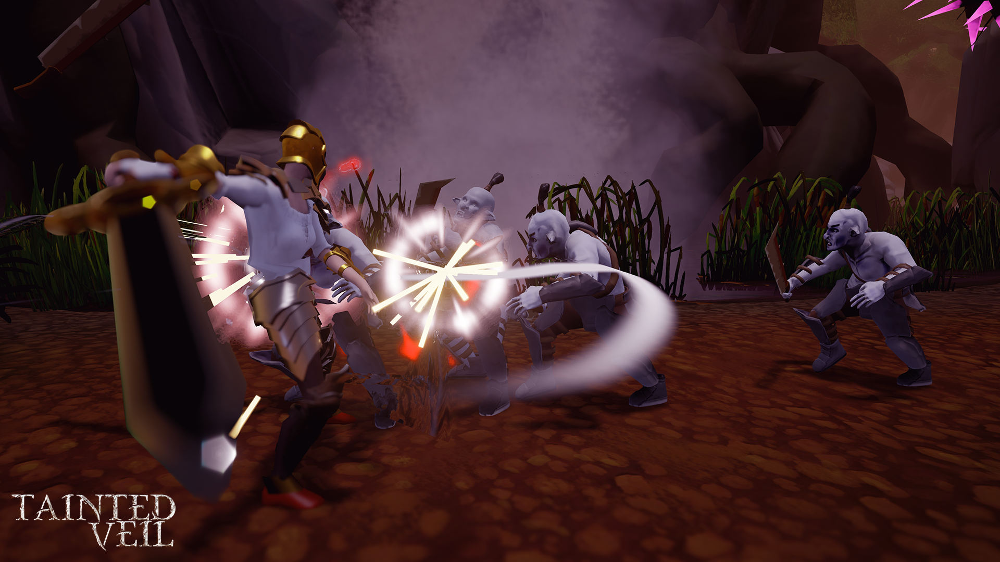
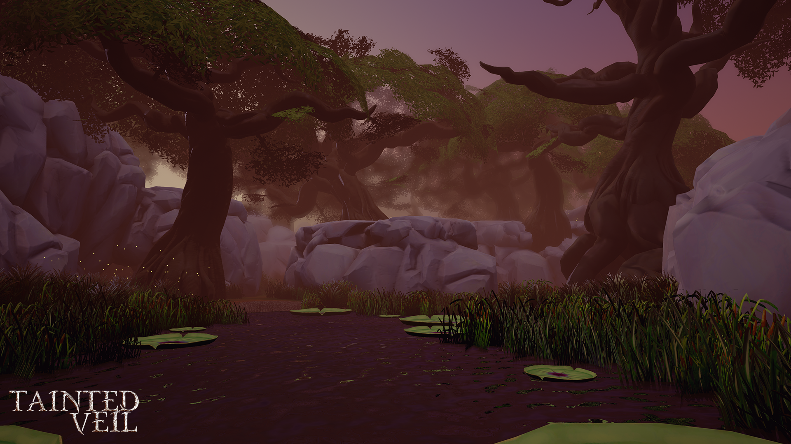
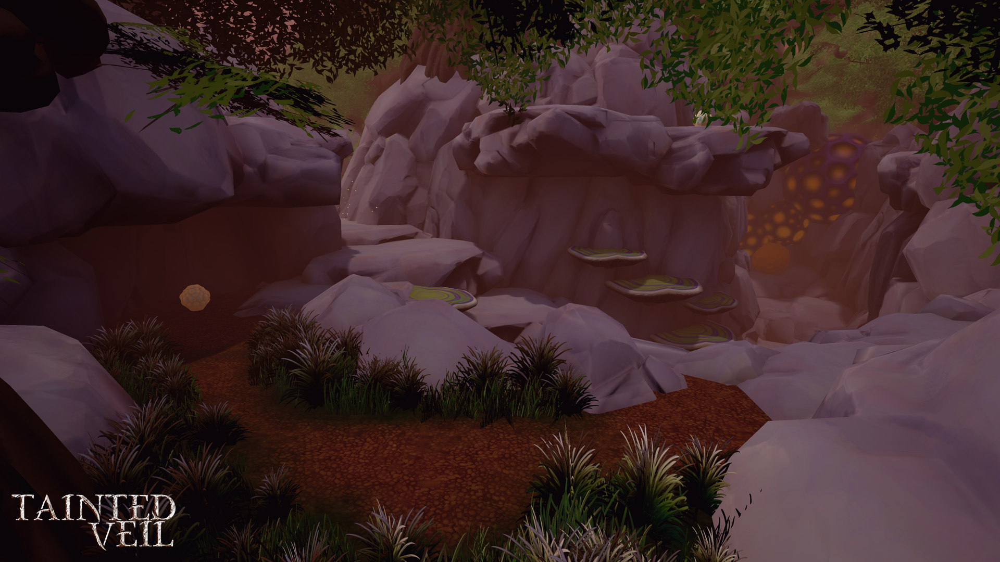
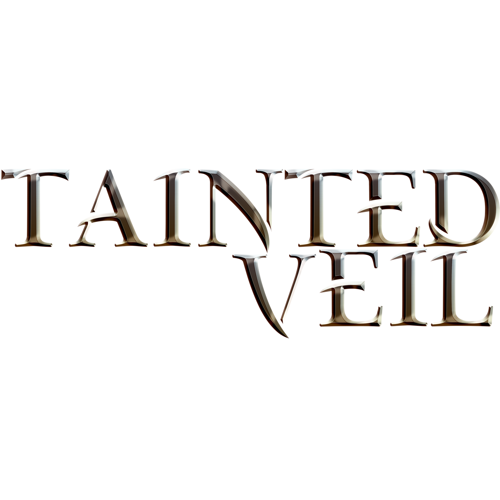

# 

## Factsheet

**Developer:**  
Team Titans

**Founding date:**  
March, 2015

**Press / Business contact:**  
[TaintedVeil][contact]

**Social:**  
[twitter.com/TaintedVeil][twitter]  
[facebook.com/TeamTitansTaintedVeil][facebook]
[Devlopment Blog][Devlog]

**Release Date:**
21st November 2015

**Download:**
Coming Soon

 
 
 
 

## Team Description
Team Titans is a team of 7 students that attend Media Design School in New Zealand. We created the game Tainted Veil as a part of a year long project, starting with 3 prototypes which we then developed into a Vertical Slice preview of the game, then to Alpha stage and finally onto Gold stage.

## Game Description

“A mysterious poison has tainted the land, it’s spreading to your hometown, you must go and cleanse the area before it’s too late!” 
Explore the vast land of Tainted Veil, find the 4 mystical gems that will give you powers beyond your wildest dream! Use these powers to explore the world and take down enemies obstructing your path.

### Key Features
<ul>
<li> Explore - Delve into a gorgeous world and navigate through four unique areas: Forestlands, Swamp, Caverns and Canyons</li>
<li> Master The Elements - Use the power of Air, Fire, Ice and Earth to traverse the vast environment and fight enemies</li>
<li> Fight Various Enemies - Engage in unique combat encounters with different kinds of enemies ranging from big brutes to crafty casters</li>
<li> Collect Items - You must find the gems that contain abilities for you yourself along with enough mysterious orbs cleanse the world</li>
<li> Platforming Puzzles - Jump on trickey rocks and other platforms to maneuver around the vast world</li>
</ul>

## Videos

We have a trailer and this is it. [And this is what we called the link](https://www.youtube.com/watch?v=WB0yAm6iXEw "Gunhouse Trailer on Youtube")  

<iframe src="//www.youtube.com/embed/WB0yAm6iXEw" frameborder="0" allowfullscreen></iframe>

## Images

download all screenshots & photos as ** [.zip (8.8 MB)](assets/images/images.zip "Images zip") **

## Logo & Icon

download logo files as ** [.zip (1 MB)]( assets/images/logo.zip "Logo & Icon zip") **

## Team

**Barak Abitbol**  
[Programmer]

**Jarryd Peterson**  
[Programmer]

**Mark Southcombe**  
[Programmer]

**Ben Bakker**  
[Artist]

**Callum Wright**  
[Artist]

**Jaidan Cheah**  
[Artist]

**Michael Chan**  
[Artist]

## Contact

**Inquiries**  
[TaintedVeil Support][contact]

** Facebook**  
[facebook.com/TeamTitansTaintedVeil][facebook]

<!--- =====================================================================  -->
<!--- Referenced links -->

[contact]: mailto:TaintedVeil@gmail.com

<!--- Social -->

[twitter]: https://twitter.com/tainted_veil
[facebook]: https://www.facebook.com/TeamTitansTaintedVeil
[Devlog]: http://forums.tigsource.com/index.php?topic=49552.msg1165640#msg1165640

